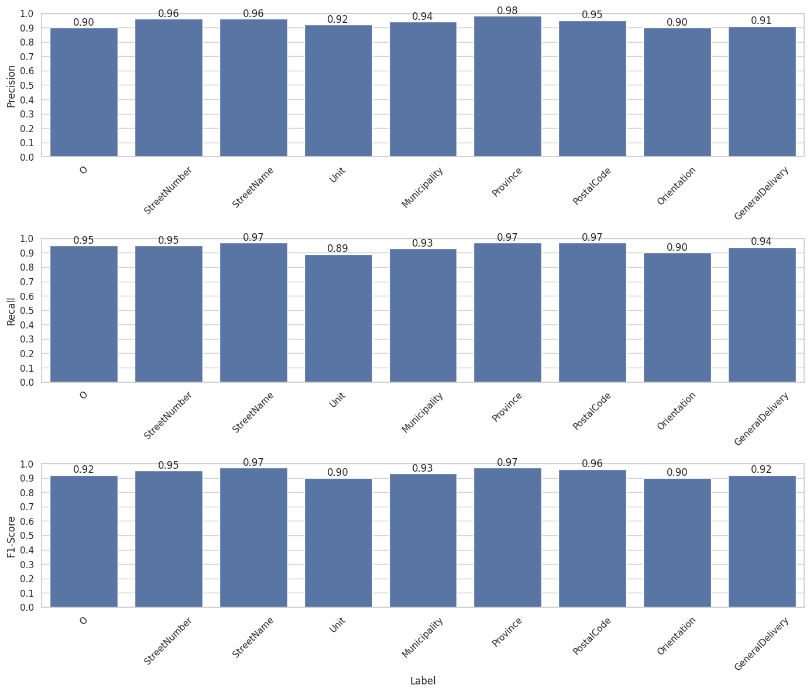
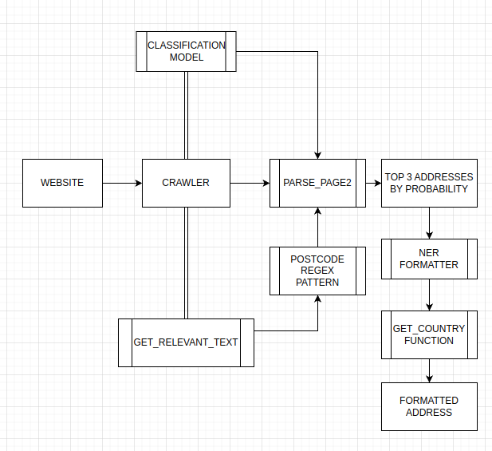

## Address Extraction Tool

This repository contains the documented development of a fast address extraction tool that can crawl the physical address of any business from it's website.The tool employs a dual-model architecture, with each model leveraging a BERT backbone from Hugging Face.

The first model is a binary Classification model featuring one fully connected (FC) layer, used for predicting the probability of a text sequence being an address. The second is a Named Entity Recognition (NER) model, tasked with formatting the address as requested.

In the following sections, I will dive deeper into the reasoning behind this architectural choice and also explain how the crawling process operates.


## Considerations

1. We are dealing with   addresses from multiple countries, in distinct formats.
2. Those websites have a very variable HTML structure.Despite this variability,the HTML data of each websites provides a really good structure and it's relatively easy to search in it.
3. The websites are in different languages.
5. The primary challenge we face is the inconsistent presentation of address information within the HTML content. Specifically, an address might be split across two or more separate tags, embedded within a tag alongside unrelated text, or, in the most straightforward scenario, isolated in a single tag.
6. All valid   addresses contain a postal code so this is a good starting point  
7. Given the high percentage (95%) of websites in the dataset representing businesses from the US, UK, and Germany (DE), I've tailored my approach specifically towards these countries to optimize accuracy and efficiency. This strategic focus allows for over 90% accuracy when analyzing data from these three nations. While the method remains applicable to websites from other countries, it achieves its highest precision within these primary targets. This approach is designed with scalability in mind, offering the potential for future expansion to encompass additional countries as needed.
8. Used 2 APIs: Deepl translator and zipcodebase
##

## Extracting text containing address

After the furniture project, my first thought was that I can use the same TrainModel class to build a classification model and apply it on all text nodes of a given website.This didn't yield the results I anticipated due to the variety of formats and the huge computation time, so I had to narrow down the list of nodes on which I apply the classification model.  

To acomplish this, I figured out that any valid address contains a postcode that can be easily found with regex, so I applied an international postcode pattern(sequences of digits with length 5-7) and an UK pattern to all text nodes from the page source which returned a list of elements.Next, I inferred each element from this list  through the model and added them to another list alongside the postcode and the probability of them being an address.

To solve the consideration at point 5. above, I came up with the following algorithm:

Suppose you have the following 3 html tags presenting an address: 
1. `<p>Russell Road, Edinburgh EH11 2LS</p>`  
2.  
```
<div>
	<span>Russel Road</span>
	<span>Edinburgh EH11 2LS</span>
</div>
``` 
3. 
`<p>The Jewelry Store </br> Address: </br> Russell Road, Edinburgh EH11 2LS </br> Email : thejewelry.store@gmail.com</p>`

The scraper filters text tags by applying a POSTCODE regex pattern to each text element containing digits. This method enables the tool to extract text elements potentially containing an address, thereby covering all possible cases. Subsequently, it appends the identified text elements to a list, alongside the discovered postal code and the probability of it being an address, as calculated through inference on the Classification model.

In the 3 presented cases, it would've extracted "Russell Road, Edinburgh EH11 2LS"(first one), "Edinburgh EH11 2LS" and `The Jewelry Store </br> Address: </br> Russell Road, Edinburgh EH11 2LS </br> Email : thejewelry.store@gmail.com"` alongside 'EH11 2LS'(postcode) and a probability.  

Because this approach isn't covering all the cases possible(eg. in example 2 will append only the postcode part), I thought of some system to concatenate, one by one, the siblings and parent elements(of the postcode text element) with the postcode itself to obtain the full address(eg. `<span>Edinburgh EH11 2LS</span>` with `<span>Russel Road</span>`), alongside their respective probability. 

For the third case, where the address is nested deep inside the text element, the scraper splits the text element, finds the `postcode part` and appends it into the list of the respective page.  

After that the scraper sorts the found  addresses based on their probability and if the top address on the first page has a probability over 0.90 it doesn't search other pages on the respective website.If not, other relevant relative links(eg. 'Contact' or 'Imprint') are parsed in the same way and are added to a list to be sorted.  

## Formatting the address

The model has a good accuracy, but given the incredible variability we can't use only the first prediction in the list, so we have to make use of all of them.
To formatt the address, the regex approach doesn't yield good results for only one country, let alone 10 or 20 more, so a NER model approach is preffered.  
The NER formatter checks all the addresses in the list and chooses the one that has the most attributes matched(eg. 'Russell Road, Edinburgh EH11 2LS' outputs the road, the city and the postcode while 'Edinburgh EH11 2LS' the city and the postcode, so the model will pick the first one.)

## NER model for Formatting
I've looked at formatting the address from all angles possible, my first thought being regex. The biggest problem with regex, and with any rule-based algorithm, is formatting an address that is surrounded by irrelevant text (e.g., `Email: sales@thermometersdirect.co.uk | 108 Hawley Lane, Farnborough, Hampshire, GU14 8JE, United Kingdom, Phone: 01252 341000, Email: sales@thermometersdirect.co.uk`). Another problem is the variety of address formats for different countries.  

After trying all the libraries possible without being satisfied, I decided that the only way to provide an accurate formatting of an address is by building a NER (Named Entity Recognition) model to label address tags like 'StreetName', 'StreetNumber', 'Municipality' AND 'O' tags for non-address text.  


The purpose is to train a NER model that not only formats clean   addresses, but also   addresses surrounded by text like `The Jewelry Store </br> Address: </br>Russell Road, Edinburgh EH11 2LS </br> Email : thejewelry.store@gmail.com`.(eg use case. if the bsoup splitter didn't work properly).  
In this example the model should mark text as follows:  
'The Jewelry Store Address:' with 'O' tags   
'Russell Road' with StreetName tags,  
'Edinburgh' with Municipality tags and  
'EH11 2LS' with PostalCode tags  

To achieve this, a pretrained DistilBert is fine-tuned with a FC layer with 9 labels : ['O', 'StreetNumber', 'StreetName', 'Unit', 'Municipality', 'Province', 'PostalCode', 'Orientation', 'GeneralDelivery'].I used a dataset with annotated   addresses from US, UK, DE, FR, ES, CZ and AU with a randomized text insertion function which inserts random text generated with gpt2 at beginning, end or in the middle like this:     
For 'Russell Road, Edinburgh EH11 2LS' it will output "'Some random text' Russell Road, Edinburgh EH11 2LS 'other random text'". with 'O' tags added to the labels list for the random text.This tehnique worked best for labeling the irrelevant text surrounding the address.

I'm using DistilBert because it's fast'for training but mor important for inference; we we will use it 3 times on each website because we try to format the first 3 picks of the address classification model.

Afer playing out a bit with the hyper-parameters, I built an accurate model with a prediction rate of 95% on unseen data, supporting those countries ['us', 'de', 'uk', 'fr', 'au', 'cz', 'es'].

The training of the NER model is in 'ner_training.ipynb' notebook and the functions for the formatter are in 'ner_model.py'  
Here is a diagram with the metrics on this model:  


## Classification Model
Leveraging the pipeline from the Furniture Scraper project made this part of the process quite straightforward.

The classification model is being used for ranking the top candidates for the addresses as follows: We calculate the probability of a text being an address and append it to a list and then we sort that list in descending order.I've used a bert-base uncased backbone with one FC layer of classification on [CLS] token.I'm labeling each data sample with either TRUE or FALSE.  

The positive labels were crawled by me from a random address generator website and for the negative samples I crawled all the websites provided in the parquet file.  
All training processes for this model are contained in train_model.py file

## Crawler
My initial attempt for the crawler was just a selenium script, but it was too slow so I chose requests library.To handle the cases in which requests library returns a non-valid page, I'm using selenium headless with a function for pop-up bypasses.In the Crawler Class we update the page source for each website and the current url accordingly, being available for all functions.  

Due to the fact that both NER and Classification models were trained in english, I had to use a translator for better accuracy, so I chose deepl API with the free package of 500 000 characters per months.  
I've optimised the crawler so as the translator API has minimum usage(the free tier is enough for around 5000 websites in non-english languages), by translating only the address with the highest probability.  


Also, because each website takes on average 3 seconds, I've written a simple multi-threading script to reduce the time needed for crawling 2500 websites from 150 minutes to 60 minutes with 3 threads.

Below is a diagram of the architecture:


## How to use
1. Download the checkpoints of the NER model and the Classification model from the links below([1] and [2])and keep the names  
2. Install dependencies with 'pip install -r requirements.txt'  
3. Run 'run.py <file_path_containing_websites>'  
4. To use the multi-threaded version un-comment the code for it and specify how many workers do you need.I reccomend maximum 5, but If you have computational   super-powers you can use as many as you want until it crashes :)  
5. The outputs are in 'results.csv' file in the format 'website, formatted_address, top_candidates'  

## Links for download

1. [Classification Model Checkpoint](https://www.dropbox.com/scl/fi/34dzvnn27abxks80cdlye/Classification_checkpoint.zip?rlkey=ddof58ikyh3c4v7hwnijam2fd&dl=0)  
2. [NER model checkpoint](https://www.dropbox.com/scl/fi/jh03q59ap42qnavj6rklq/NER_checkpoint.zip?rlkey=b70nodub7qd30t3usnf7u4dwo&dl=0)  
3. [Training data - Classification Model](https://www.dropbox.com/scl/fi/o4774cmstt420t2yzmw7o/Classification_data.zip?rlkey=oyvzl44rx4fjvk4h9b4yazulk&dl=0)  
4. [Training data - NER Model](https://www.dropbox.com/scl/fi/mq7vfpevn35vy1lc7z98o/NER_data.zip?rlkey=ruynqf5i0uhwok51hc0aprrpx&dl=0)  

## Additional Notes

The architecture could be easily extended to accommodate additional countries by incorporating training data consisting of addresses into specific folders and then retraining the models to improve their performance on the newly added data.The API keys are in the project because they are limited to the free plan without payment and cards.
